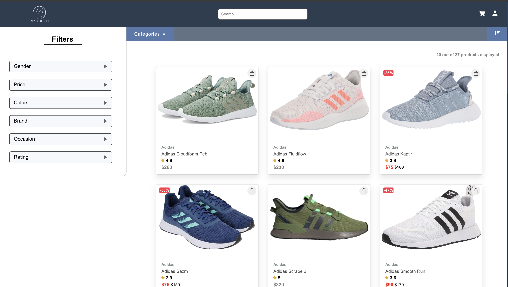
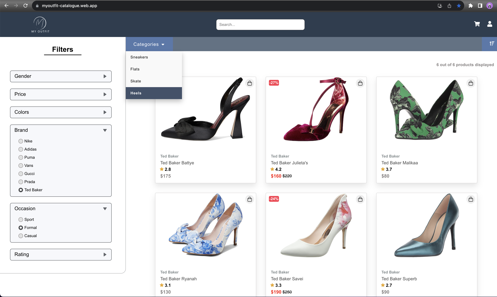

# MyOutfit
MyOutfit: A React Single Page Application for shoes, consisting of a catalogue of products (shoes).

## Project Description
MyOutfit is a responsive React web application. It was made purely for educational purposes. The application features a simple product page that showcases different categories of shoes including sneakers, flats, skate shoes, and heels. It offers a filter menu that allows users to narrow down their search by various attributes such as color, price, brand, gender, and rating. Additionally, a sorting mechanism is available to sort the products by price, discount, and other criteria. Each product listing includes essential details such as price, discount (if applicable), and the name of the shoe. The application also includes a search bar to quickly find specific products.

## Features
- **Product Categories**: Browse shoes by categories: sneakers, flats, skate, heels.
- **Filter Menu**: Filter products by color, price, brand, gender, and rating.
- **Sorting Mechanism**: Sort products by price or discount.
- **Search Bar**: Quickly find products using the search bar.
- **Product Details**: View essential product details: price, discount (if applicable), and name.

- **Responsive design**: Responsiveness ensuring seamless user experiences across a wide range of screen resolutions, from 280 to 2000+ pixels, providing versatility and accessibility.

## Live Demo
The application is deployed and can be accessed [here](https://myoutfit-catalogue.web.app/).

## Installation and Setup
1. **Clone the Repository**
2. **Install Dependencies**
3. **Start the Application**
The application will start running on [http://localhost:3000](http://localhost:3000).

## Usage
- **Browse Products**: On the homepage, you can browse through different categories of shoes.
- **Filter Products**: Use the filter menu on the left side of the page to filter the products based on various attributes like color, price, brand, gender, and rating.
- **Sort Products**: Use the sorting dropdown on the top right of the product listing to sort the products by price or discount.
- **Search for Products**: Use the search bar on the top of the page to quickly find specific products.
- **View Product Details**: Click on a product to view its detailed information including price, discount (if applicable), and name.

## Technologies Used
- **React**: Used for building the user interface of the application.
- **CSS**: Used for styling the application.

## Images
Default home page, containing all products, non-filtered by anything, by default the selected category is 'Sneakers', so all the sneakers available are shown:

- Filtration by multiple criterias:

- Another filtration showcase:

- Selecting different category, while having filtrations applied:

- Selecting another category, while having different filtrations applied:

- Sorting products by price:

- Load more button - it only shows if the limit of 20 products is exceeded and there are more products to be shown:

- Load less button - it only shows if the 'Load more button' was previously selected, it returns only the initial 20 products:

- Search bar with suggestions:

- Responsive design:

- Products filtration responsiveness:

